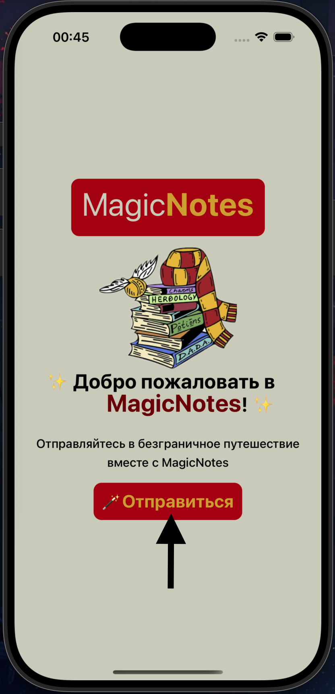

## Мобильное приложение заметок на React Native(EXPO)


### Описание проекта
Мобильное приложение MagicNotes с графическим пользовательским интерфейсом поддерживает создание, редактирование,
удаление и поиск заметок в рамках работы любой организации. Приложение обеспечивает удобство ведения записей во время
разлтчных мероприятий

### Запуск приложения

#### Клонирование репозитория
```
git clone https://github.com/ArtKonX/notes-expo-app.git
```

#### Установка зависимостей
```
yarn
```

#### Запуск приложения
```
yarn start
```

### Основные функции приложения:
1. Создание заметки – возможность создания новой записи с указанием заголовка, даты, времени и содержания ✅

<div style="width: 100%; display: flex; justify-content: center; padding: 25px 0;">
    
</div>

Дату и время можно не указывать, тогда эта информация будет выбрана автоматически.
Выбрать время и дату можно по нажатию на область 1 или 2(Показаны стрелками)

<div style="width: 100%; display: flex; justify-content: center; padding: 25px 0;">
    
</div>

<div style="width: 100%; display: flex; justify-content: center; padding: 25px 0;">
    
</div>

1. Редактирование и удаление заметки – возможность изменения существующей записи и ее удаление ✅
   При нажатии на подобные блоки(показаны стрелками) происходит переход на страницу просмотра, редактирования и удаления заметки.

<div style="width: 100%; display: flex; justify-content: center; padding: 25px 0;">
    
</div>

   На этой странице также, как и на странице создания заметки есть возможность сохранить изменения выбрать дату и время, если это требуется и удалить заметку(блок взаимодействия показан стрелкой)

<div style="width: 100%; display: flex; justify-content: center; padding: 25px 0;">
    
</div>

1. Поиск заметки – функция поиска, по ключевым словам, дате, времени или другим параметрам ✅
   Выполняется в зависимости от выбранного места сохрания(SQLite, AsyncStorage или файловой системы)

<div style="width: 100%; display: flex; justify-content: center; padding: 25px 0;">
    
</div>

### Варианты хранения данных:

Приложение придусматривает два способа хранения заметок:
- В базе данных SQLite (локальное хранение).
- AsyncStorage
- С использованием файловой системы устройства (например, сохранение заметок в виде файлов).
#### Выбрать место хранения можно:
  1. В приветствии при первом открытии приложения:

<div style="width: 100%; display: flex; justify-content: center; padding: 25px 0;">
    
</div>

<div style="width: 100%; display: flex; justify-content: center; padding: 25px 0;">
    
</div>

  2. В иконке справа ввиде дискеты:

<div style="width: 100%; display: flex; justify-content: center; padding: 25px 0;">
    
</div>

### Стек технологий
1. React Native
2. EXPO
3. SQLite
4. TypeScript
5. React Native Context API
6. NativeWind

### Замечания
##### Приложение протестировано только на iPhone, работоспособность на других устройствах не гарантируется

### Планы на будущие обновления приложения
1. Красивая анимация переходов
2. Лоадер для загрузок
3. Тестирование приложения
4. Улучшение дизайна
5. Загрузка приложения в AppStore
6. Оптимизация под Android
7. Загрузка приложения в GooglePlay и RuStore

### Команда разработчиков
<a href="https://github.com/ArtKonX" style='color: black; font-weight: bold'>ArtKonX</a> — ведущий разработчик проекта